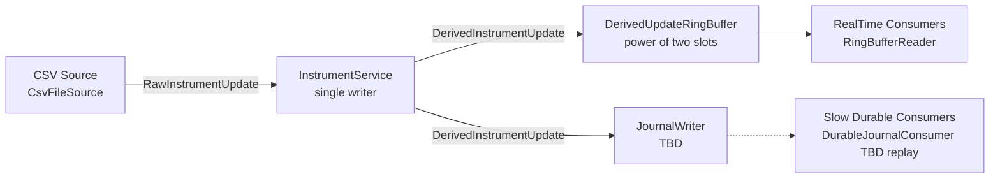

# Derived Instrument Publisher

This project demonstrates a low-latency **source → service → ring buffer → consumer** pipeline for derived instrument values, using a **single-writer / multi-reader** design.

## Submission notes

### Assumptions where the brief was silent
- Consumers are mainly interested in the **latest updates**.
- With buffer overflow, it is acceptable to **overwrite old entries**.

### Tradeoffs and why this design was chosen
- There is a tradeoff between supporting every consumer style and keeping memory bounded.
- To keep the in-memory path fast and limited, the ring buffer is intentionally lossy under pressure.
- For slower/strict consumers, a **journal-based durable path** is defined as an extension point (**TBD**).

### What I would do with more time
- Improve memory efficiency and GC-friendliness of the ring buffer and service. Currently, objects are created per update, which is not ideal for high-throughput workloads.
- Pre-allocate and reuse objects where possible.
- Add better consumption strategies beyond one lossy latest-only pattern.
- Implement `JournalWriter` and end-to-end at-least-once durable consumption.
- Handle journal crash/restart edge cases more deeply (recovery semantics, checkpointing, replay boundaries).
- Handle restart of the Service and ability to recover from the sources rather getting pushed from CSV source.
- Implement UDP based source
- Create a monitoring and Admin UI to tap the stats exposed by the service and consumers.

### Time spent
- Since this was a second attempt, implementation was quicker.
- ~1 hour for the design skeleton.
- ~1 hour for refactoring and edge-case handling.

### Considered and consciously rejected
- **NIO-heavy implementation**: rejected to keep the solution easier to follow.
- **Consumers as separate processes**: rejected to keep the solution simple for this scope.

### AI usage
- Used **Codex GPT-5.3** heavily for iterative implementation and refactoring.
- Used it specifically to reason about low-latency ring-buffer patterns, single-writer concurrency, consumer pacing, and architecture documentation.
- Context was set to the problem domain and design goals with respect to how the RingBuffer and service should behave under load, and how to structure the consumer interface.
- After that it was used iteratively to generate code, review, and correct it, rather than copy/paste output.

## Design overview

### Core flow

1. **Source** (`CsvFileSource`) reads raw market rows from CSV.
2. **Service** (`InstrumentService`) validates ordering, maintains per-instrument state, computes derived value, publishes to ring buffer, and writes to journal abstraction.
3. **RingBuffer** (`DerivedUpdateRingBuffer`) stores recent derived updates for real-time consumers.
4. **Consumers** process updates independently.

### Architecture diagram



## Key principles

### 1. Source responsibilities
- Parses input rows into `RawInstrumentUpdate`.
- Converts decimal values to scaled long (`ScaledLong`, scale=6) to avoid floating-point drift.
- Drops malformed rows and tracks source statistics.

### 2. Service responsibilities
- Enforces **single writer principle** (`InstrumentService.onSourceUpdate`).
- Tracks per-instrument state (`base_rate`, `spread`, optional `adjustment`).
- Drops stale timestamp updates.
- Publishes `DerivedInstrumentUpdate` only when required inputs are present.
- Writes each published update to journal abstraction (`JournalWriter`, currently placeholder).

### 3. Ring buffer responsibilities
- Lock-free publish/read model:
  - writer updates slot then advances volatile `headSequence`
  - readers poll by sequence
- Supports overwrite behavior under pressure; readers detect misses/gaps.
- Optimized for many readers with one writer.

### 4. Consumer separation
- **Real-time consumers** read from in-memory ring buffer via `RingBufferReader`.
- **Slow/durable consumers** are separated behind the journal boundary.
- Durable replay/checkpoint behavior is intentionally marked **TBD** and modeled by `DurableJournalConsumer` + `JournalWriter` abstractions.

## Running the program

### Prerequisites
- Java 17+
- Maven 3.9+

### 1. Build

```bash
mvn -q -DskipTests package dependency:copy-dependencies
```

### 2. Run

Use the included sample input:

```bash
java -cp "target/classes:target/dependency/*" \
  com.bj.publisher.Main \
  src/test/resources/market_inputs.csv
```

The program will:
- start real-time consumers
- replay the CSV source in repeated bursts (default: 3 runs)
- wait 5 seconds between bursts to simulate bursty updates
- wait until consumers catch up
- print final stats
- exit (or stop early on Ctrl+C)

Burst settings are currently internal constants in `Main`:
- `SOURCE_REPEAT_COUNT`
- `SOURCE_REPEAT_INTERVAL_SECONDS`

## Example output (abridged)

```text
2026-10-01 00:58:12.110 INFO  [Main] Fast Consumer seq=1 instrument=ALPHA derived=4.6982
2026-10-01 00:58:12.114 INFO  [Main] Slow Consumer seq=1 instrument=ALPHA derived=4.6982
2026-10-01 00:58:12.950 INFO  [Main] Source finished at sequence=12345. Waiting for consumers to catch up (Ctrl+C to stop).
2026-10-01 00:58:14.012 INFO  [Main] Final source stats: SourceStats[currentSequence=..., totalEventsRead=..., updatesPublished=..., malformedDropped=..., staleDropped=...]
2026-10-01 00:58:14.012 INFO  [Main] Final service stats: InstrumentServiceStats[currentDerivedSequence=..., sourceEventsReceived=..., derivedEventsPublished=..., staleEventsDropped=..., instrumentCount=..., ringBufferCapacity=..., ringBufferOccupancy=..., consumerCount=..., slowestConsumerLag=...]
2026-10-01 00:58:14.013 INFO  [Main] Final fast consumer stats: RealTimeConsumerStats[name=realtime-fast, ...]
2026-10-01 00:58:14.013 INFO  [Main] Final slow consumer stats: RealTimeConsumerStats[name=realtime-slow, ...]
```

## Input format

CSV header:

```text
timestamp_ms,instrument,input_type,value
```

`input_type` values:
- `base_rate`
- `spread`
- `adjustment`
